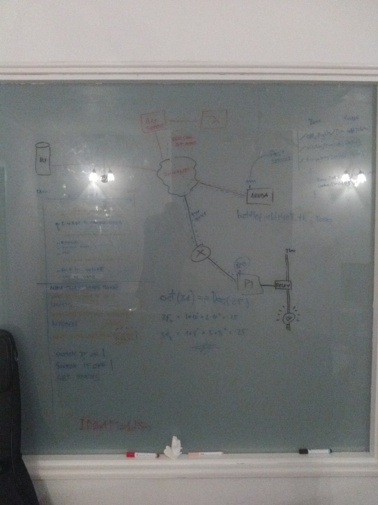
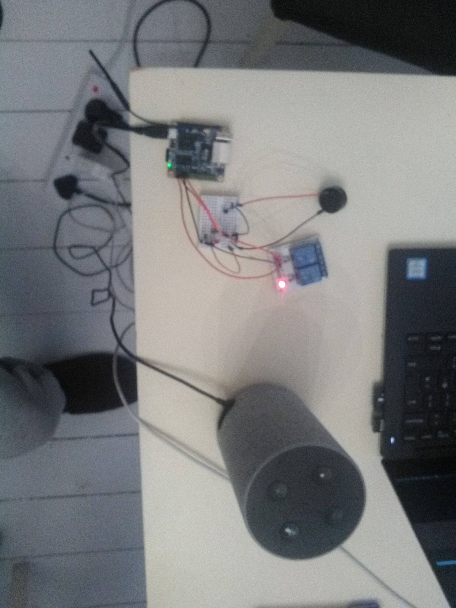

# mySmartHouse

## Introduction

This a custom Alexa Skill which switch on and of a light managed [http://www.orangepi.org/](http://www.orangepi.org/).

OrangePi board manage the communication with Alexa as well as all wired hardware for simulating the house lights for zone: kitchen, living room and all lights (the two before)

## Diagram

Find below a diagram for the conection between Alexa and the OrangePi board as well as some business case

## OrangePi

The orangePi code has been developed by Carlos Novo and follow this link for getting it, [https://github.com/bitelxux/orangepi](https://github.com/bitelxux/orangepi)

